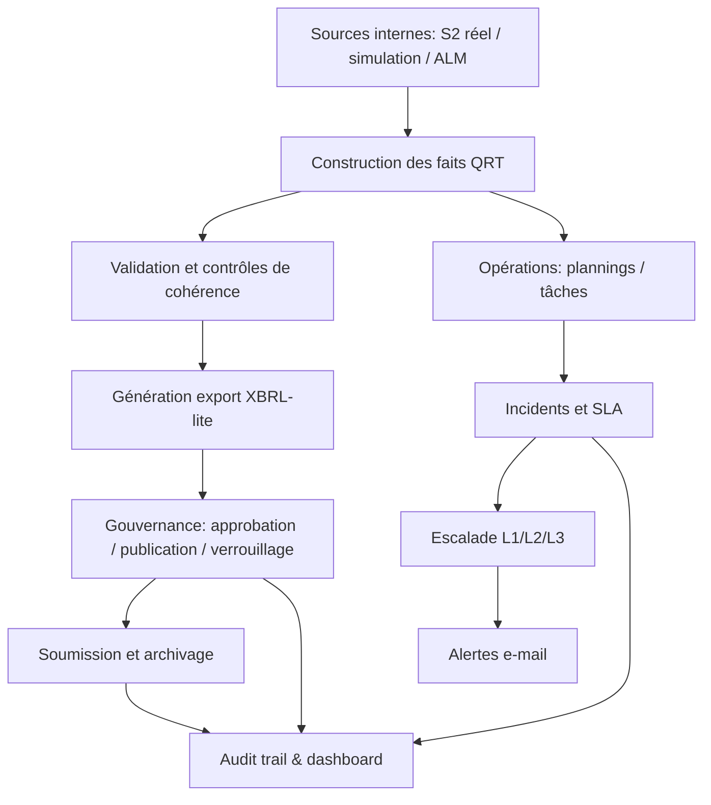
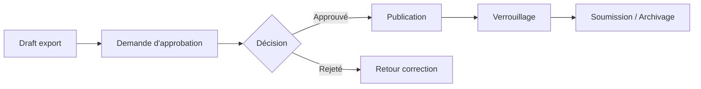
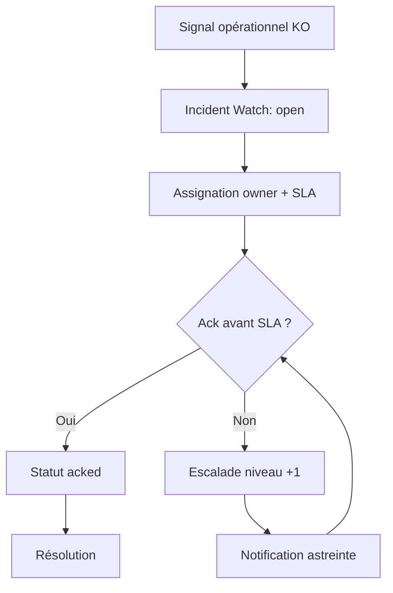

@captiva-risks.com# QRT Process - Cadre Opérationnel et Réglementaire

## 1) Objet du document

Ce document décrit le fonctionnement opérationnel QRT dans CAPTIVA, dans une logique:
- de conduite des opérations quotidiennes par les équipes,
- de lisibilité pour les instances de gouvernance,
- de traçabilité pour revue régulateur.

Il formalise les processus en mode littéraire, avec le format:
- **Qui**
- **Quoi**
- **Quand**
- **Où**
- **Comment**

## 2) Schéma directeur des processus QRT

## 3) Liste des processus opérationnels

## 3.1 Processus P1 - Construction des faits QRT

**Qui**  
L'équipe Risques/Actuariat déclenche le processus, manuellement ou via runbook.

**Quoi**  
Le moteur QRT transforme les données de solvabilité et d'actifs en faits QRT structurés.

**Quand**  
À chaque clôture périodique, à chaque recalcul demandé, et à chaque reprise après correction.

**Où**  
API QRT (`/api/qrt/facts/build`) et stockage en base (`qrt_facts`).

**Comment**  
La date de snapshot et la source (`real` ou `simulation`) sont fixées. Les faits sont recalculés, persistés, puis rendus disponibles pour validation et export.

## 3.2 Processus P2 - Validation de cohérence

**Qui**  
L'équipe Contrôle/Risque avec supervision CFO.

**Quoi**  
Contrôles de cohérence des ratios, des équilibres de bilan et de la complétude.

**Quand**  
Avant toute publication; après chaque recalcul significatif.

**Où**  
API QRT (`/api/qrt/validate`) et dashboard QRT.

**Comment**  
Les contrôles produisent un état `ok/warning/error`. Les erreurs bloquantes stoppent la publication et déclenchent correction ou dérogation formelle.

## 3.3 Processus P3 - Génération d'export et cycle de gouvernance

**Qui**  
Risk Manager/CFO en préparation; validation par rôles habilités; supervision gouvernance.

**Quoi**  
Production du fichier exportable, demande d'approbation, publication, verrouillage.

**Quand**  
Après validation technique et métier.

**Où**  
Routes export/gouvernance QRT et tables `qrt_exports`, `qrt_approvals`.

**Comment**  
L'export passe de `draft` à `published`, puis peut être `locked`. Le verrouillage interdit toute altération du livrable final.

### Schéma P3

## 3.4 Processus P4 - Planification opérationnelle (runbook)

**Qui**  
Équipe Opérations QRT (pilotage), sous responsabilité Risk/CFO.

**Quoi**  
Orchestration des tâches automatiques: scans, relances, clôture mensuelle, rétention.

**Quand**  
Selon les fréquences planifiées (`hourly/daily/weekly/monthly`).

**Où**  
`qrt_schedules`, `jobs`, worker ops (`ops:qrt:once` en boucle service).

**Comment**  
Les plannings actifs alimentent une file de jobs. Les jobs sont exécutés par le worker; les statuts sont historisés (`success/failed`) avec erreurs.

## 3.5 Processus P5 - Gestion des tâches opérationnelles

**Qui**  
Équipe Opérations, Risk Manager, intervenants désignés.

**Quoi**  
Suivi des actions à traiter (`todo`, `in_progress`, `blocked`, `done`) avec priorité et échéance.

**Quand**  
En continu, avec revue quotidienne.

**Où**  
Page Pilotage Opérations et table `qrt_tasks`.

**Comment**  
Chaque tâche porte un propriétaire et une échéance; les retards ou blocages alimentent la détection d'incident.

## 3.6 Processus P6 - Détection incident et SLA d'acquittement

**Qui**  
Système (détection automatique), puis équipe d'astreinte (acquittement et traitement).

**Quoi**  
Consolidation d'incidents (échec planning, échec alerting, tâche bloquée, tâche en retard) avec SLA d'ack.

**Quand**  
À chaque scan incidents et maintenance worker.

**Où**  
`qrt_incident_watch`, routes `/api/qrt/incidents/*`, cockpit opérations.

**Comment**  
Un incident ouvert reçoit un `ack_due_at`. Sans acquittement dans le SLA, il passe en escalade automatique.

### Schéma P6

## 3.7 Processus P7 - Escalade L1 / L2 / L3

**Qui**  
Astreinte L1, puis L2, puis L3 (direction) selon non-acquittement.

**Quoi**  
Escalade graduée avec routage de destinataires par niveau.

**Quand**  
Dès dépassement SLA d'acquittement et ensuite à intervalle contrôlé.

**Où**  
Règles `qrt_alert_rules` (plages `min/max escalation level`) et `qrt_alert_deliveries`.

**Comment**  
Le niveau d'escalade augmente (`L1 -> L2 -> L3`). Chaque niveau cible un groupe de destinataires distinct, évitant l'ambiguïté d'astreinte.

## 3.8 Processus P8 - Notification e-mail d'alerte

**Qui**  
Worker QRT (automate), supervision Ops.

**Quoi**  
Envoi des notifications selon règles événement/sévérité/niveau.

**Quand**  
À création de job `qrt.alert.email`.

**Où**  
Pipeline jobs + provider mail (webhook ou SMTP fallback).

**Comment**  
Le worker applique cooldown et routage. Les tentatives et résultats sont journalisés (`sent/failed`) pour audit et reprise.

## 3.9 Processus P9 - Supervision et pilotage du risque opérationnel

**Qui**  
CFO, Risk Manager, équipe Ops.

**Quoi**  
Lecture consolidée des indicateurs: incidents ouverts, retards, blocages, échecs d'alerte.

**Quand**  
En continu avec revue quotidienne et comité périodique.

**Où**  
Dashboard global et cockpit `/pilotage/operations`.

**Comment**  
Les indicateurs orientent les arbitrages opérationnels et permettent une preuve de maîtrise du dispositif.

## 3.10 Processus P10 - Audit, traçabilité et preuves

**Qui**  
Contrôle interne, conformité, auditeurs internes/externes.

**Quoi**  
Constitution de la piste d'audit: actions utilisateur, événements, états export.

**Quand**  
À chaque action critique (publish, lock, ack, resolve, etc.).

**Où**  
Journaux d'audit applicatifs + tables fonctionnelles QRT.

**Comment**  
Chaque étape est horodatée, attribuée et conservée, permettant reconstitution chronologique des décisions.

## 4) Catalogue détaillé des tâches opérationnelles (avec Où explicite)

| Tâche | Qui | Quoi | Quand | Où | Comment |
|---|---|---|---|---|---|
| T1 Construire les faits | Risque/Actuariat | Lancer reconstruction des faits QRT | Clôture, recalcul, reprise | UI `/pilotage/operations` + `POST /api/qrt/facts/build` + table `qrt_facts` | Build par `source` et `snapshot_date`, puis contrôle |
| T2 Valider les faits | Contrôle/Risque | Vérifier cohérence technique et métier | Après T1 et avant export | UI QRT + `POST /api/qrt/validate` | Analyse `ok/warning/error`, blocage si erreur |
| T3 Générer export | Risk Manager/CFO | Créer export XBRL-lite | Après validation | `POST /api/qrt/export/xbrl-lite` + table `qrt_exports` | Génération en état `draft` |
| T4 Demander approbation | CFO/Risk | Soumettre export au workflow de validation | Avant publication | `POST /api/qrt/approvals/request` + table `qrt_approvals` | Demande formelle avec piste d'audit |
| T5 Publier export | CFO/Risk habilité | Passer export en production réglementaire | Après approbation | `POST /api/qrt/export/publish` + `qrt_exports.status` | Passage `draft -> published` |
| T6 Verrouiller export | CFO/Risk habilité | Rendre export non modifiable | Après publication | `POST /api/qrt/export/:id/lock` + `qrt_exports.is_locked` | Gel d'intégrité du livrable |
| T7 Planifier scans/jobs | Ops QRT | Configurer fréquences automatiques | Mise en service et ajustements | UI `/pilotage/operations` + `POST/PATCH /api/qrt/schedules` + `qrt_schedules` | Fréquences `hourly/daily/weekly/monthly` |
| T8 Exécuter planning manuel | Ops QRT | Déclencher un run immédiat | En reprise incident ou test | `POST /api/qrt/schedules/:id/run-now` + `jobs` | Création job immédiat |
| T9 Suivre tâches runbook | Ops/Managers | Créer et mettre à jour tâches | Quotidien | UI `/pilotage/operations` + `POST/PATCH /api/qrt/tasks` + `qrt_tasks` | Statut, priorité, owner, échéance |
| T10 Scanner alertes | Ops QRT | Détecter échecs workflow/submission/webhook | Périodique et à la demande | `POST /api/qrt/alerts/scan` + `qrt_alert_deliveries` | Génère notifications selon règles |
| T11 Synchroniser incidents | Ops QRT | Consolider incidents ouverts/résolus | Continu | `POST /api/qrt/incidents/sync` + `qrt_incident_watch` | Upsert incidents à partir des signaux KO |
| T12 Assigner incident | Astreinte / Manager | Désigner owner et SLA | Dès création incident | `PATCH /api/qrt/incidents/watch/:id` action `assign` + `qrt_incident_watch` | Owner + `sla_minutes` + `ack_due_at` |
| T13 Acquitter incident | Astreinte | Marquer prise en charge | Avant SLA | `PATCH /api/qrt/incidents/watch/:id` action `ack` + `qrt_incident_acks` | Horodatage et notes d'ack |
| T14 Résoudre incident | Astreinte / Manager | Clôturer incident traité | Après correction | `PATCH /api/qrt/incidents/watch/:id` action `resolve` | Passage en `resolved` |
| T15 Escalader automatiquement | Worker QRT | Monter L1/L2/L3 si non-ack | Après dépassement SLA | Worker `ops/qrt-ops-worker.mjs` + `qrt_incident_watch.escalation_count` + `qrt_alert_rules` | Routage par niveau et sévérité |
| T16 Envoyer notifications mail | Worker QRT | Envoyer alertes incident/process | À chaque job mail | `jobs(type=qrt.alert.email)` + `qrt_alert_deliveries` + provider (webhook/SMTP) | Cooldown, statut `sent/failed`, traçabilité |
| T17 Vérifier readiness prod | Ops/Tech lead | Contrôler état global avant/après release | Avant et après déploiement | Script `npm run verify:qrt:prod` | Vérifie schéma, règles, provider mail, couverture escalade |

## 5) Matrice synthétique Qui/Quoi/Quand/Où/Comment

| Processus | Qui | Quoi | Quand | Où | Comment |
|---|---|---|---|---|---|
| P1 Construction faits | Risque/Actuariat | Calcul faits QRT | Clôture + recalcul | API + `qrt_facts` | Build contrôlé par date/source |
| P2 Validation | Contrôle/Risque | Vérifier cohérence | Avant publication | API validate + dashboard | Bloquer si erreurs |
| P3 Gouvernance export | CFO/Risk | Publish/lock | Après validation | `qrt_exports`, `qrt_approvals` | Workflow d'approbation |
| P4 Planification | Ops QRT | Exécuter jobs | Selon fréquence | `qrt_schedules`, `jobs` | Worker automatisé |
| P5 Tâches | Ops/Managers | Suivre actions | Quotidien | `qrt_tasks` | Statuts + échéances |
| P6 Incidents SLA | Système + Astreinte | Ouvrir/ack/résoudre | Continu | `qrt_incident_watch` | SLA + assignation |
| P7 Escalade | L1/L2/L3 | Escalader non-ack | Après SLA | Règles alertes | Niveaux ciblés |
| P8 Alerting mail | Worker | Notifier | À chaque event | `qrt_alert_deliveries` + mail provider | Cooldown + journalisation |
| P9 Supervision | CFO/Risk/Ops | Piloter indicateurs | Continu | Dashboard ops | Suivi risque opérationnel |
| P10 Audit | Contrôle/Conformité | Produire preuves | Continu | logs/tables QRT | Traçabilité horodatée |

## 6) Planning semestriel et annuel

Le planning ci-dessous formalise les échéances minimales de gouvernance QRT.  
Il complète les opérations quotidiennes et mensuelles du runbook.

### 6.1 Planning semestriel

| Période | Qui | Quoi | Quand | Où | Comment |
|---|---|---|---|---|---|
| S1 (Janvier-Juin) | CFO + Risk Manager + Ops lead | Revue semestrielle du dispositif QRT | Semaine 26 (fin juin) | Comité de pilotage + dashboard `/pilotage/operations` + exports QRT | Revue incidents, SLA, qualité données, conformité des publications |
| S1 (Janvier-Juin) | Conformité + Contrôle interne | Revue de traçabilité et auditabilité | Semaine 24-26 | Journaux audit + tables `qrt_exports`, `qrt_incident_watch`, `qrt_alert_deliveries` | Échantillonnage des événements critiques (publish, lock, escalation, resolve) |
| S2 (Juillet-Décembre) | CFO + Risk Manager + Ops lead | Revue semestrielle du dispositif QRT | Semaine 50 (mi/fin décembre) | Comité de pilotage + cockpit opérations | Bilan de robustesse, écarts semestriels, plan d'amélioration |
| S2 (Juillet-Décembre) | IT Ops + Référent sécurité | Test de continuité opérationnelle | Semaine 47-49 | Environnement prod (API, worker, DB) | Test redémarrage contrôlé, test runbook incident, validation supervision |

### 6.2 Planning annuel

| Période | Qui | Quoi | Quand | Où | Comment |
|---|---|---|---|---|---|
| Annuel (T1) | Direction + CFO + Risk Manager | Validation annuelle du cadre QRT | Avant fin mars | Comité de gouvernance + dossier documentaire QRT | Approbation des règles, rôles, seuils de contrôle et dispositif d'astreinte |
| Annuel (T2) | IT + Conformité | Revue de sécurité et accès | Avant fin juin | IAM/Users + tables rôles + API access | Vérification des habilitations, rotation secrets, comptes dormants |
| Annuel (T3) | Ops QRT + IT Ops | Exercice de reprise et rollback | Avant fin septembre | Procédure de déploiement + backup/restauration | Test de restauration DB + redéploiement applicatif + revalidation readiness |
| Annuel (T4) | Contrôle interne + Audit | Revue annuelle de conformité régulateur | Avant fin décembre | Dossier QRT Process + QRT Technical + preuves d'exécution | Consolidation des preuves, écarts, remédiations et feuille de route N+1 |

### 6.3 Jalons techniques minimaux associés au planning

| Fréquence | Contrôle | Où | Critère attendu |
|---|---|---|---|
| Mensuel | Readiness QRT | `npm run verify:qrt:prod` | `ok: true` (0 erreur) |
| Mensuel | Escalade astreinte | `npm run verify:qrt:oncall` | Routage L1/L2/L3 valide |
| Semestriel | Revue règles alertes | `qrt_alert_rules` + UI opérations | Destinataires, sévérité, niveaux d'escalade cohérents |
| Annuel | Test continuité complet | API health + worker service + DB backup restore | Reprise opérable dans délai défini |

## 7) Principes de gouvernance appliqués

- Séparation des responsabilités (production, validation, décision).
- Traçabilité bout-en-bout des actions et états.
- Gestion explicite des exceptions via incidents et escalade.
- Contrôle de l'intégrité des livrables avant diffusion.
- Capacité de démontrer le dispositif à une revue régulateur.

## 8) Positionnement réglementaire

Le dispositif QRT CAPTIVA est conçu comme un socle de production et de pilotage contrôlé:
- il structure la chaîne de préparation QRT,
- il renforce la gouvernance opérationnelle,
- il maintient des preuves auditables de bout en bout.

La validation réglementaire finale du contenu chiffré reste de la responsabilité de l'entité assujettie, selon son cadre de conformité et ses obligations de déclaration.
