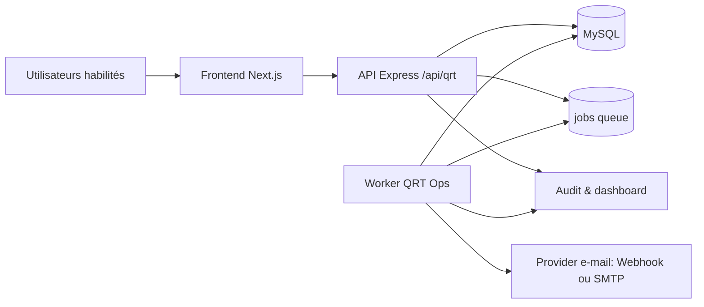
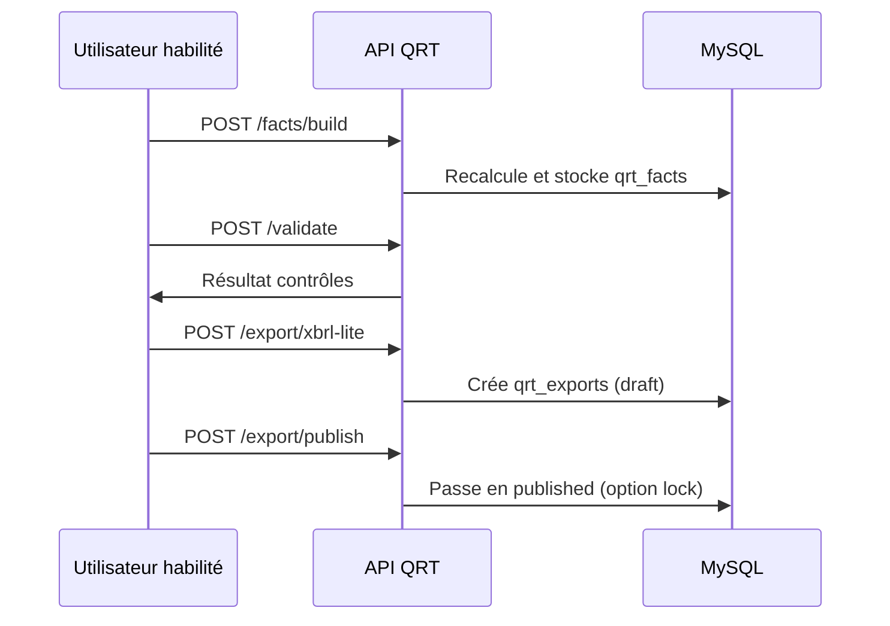
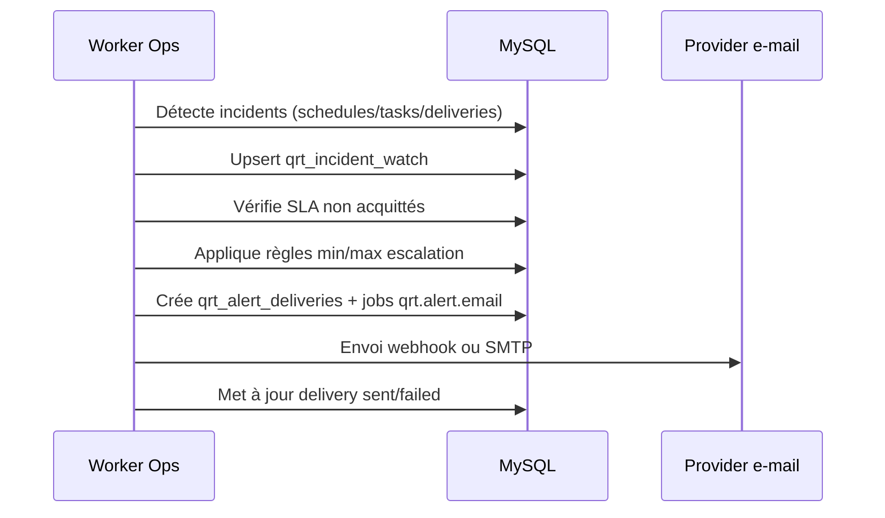

# QRT Technical - Dossier de Validation Régulateur / FINTECH

## 1) Objet et périmètre

Ce document présente la conception technique du dispositif QRT CAPTIVA pour:
- revue de conformité et de robustesse,
- validation FINTECH de l'outillage,
- justification d'exploitation en environnement de production.

Périmètre couvert:
- API QRT,
- couche données QRT,
- automatisation opérationnelle (worker, jobs, escalade),
- contrôles d'intégrité, traçabilité, supervision.

## 2) Architecture logique

## 3) Composants applicatifs

### 3.1 API QRT

- Point d'entrée: `/api/qrt/*`
- Contrôle d'accès par JWT + rôles (`admin`, `cfo`, `risk_manager`, `actuaire`, `conseil`)
- Endpoints structurés par domaines:
  - facts / validate
  - export / publication / lock
  - approvals / workflow / submission
  - schedules / tasks / alerts
  - incidents / acks / watch
  - health / dashboard / compliance

Référence d'interface: `docs/qrt/API_CONTRACT.md`.

### 3.2 Worker opérations QRT

- Script: `ops/qrt-ops-worker.mjs`
- Modes:
  - `ops:qrt:tick` (planification)
  - `ops:qrt:run` (exécution jobs)
  - `ops:qrt:once` (tick + run)
- Déploiement prod: service `systemd` en boucle contrôlée.

### 3.3 Frontend opérationnel

- Vue dédiée: `/pilotage/operations`
- Capacités:
  - création/suivi plannings,
  - suivi tâches,
  - règles et délivrances d'alertes,
  - incidents (assign / ack / resolve),
  - filtres de sévérité/statut et vue SLA.

## 4) Modèle de données QRT (tables critiques)

### 4.1 Orchestration

- `jobs`: file de traitement asynchrone.
- `qrt_schedules`: planification runbook.
- `qrt_tasks`: tâches opérationnelles.

### 4.2 Alerting et incident management

- `qrt_alert_rules`
  - mapping `event_code` + `severity` + plage d'escalade (`min_escalation_level`, `max_escalation_level`)
  - destinataires et cooldown
- `qrt_alert_deliveries`
  - état de délivrance (`queued/sent/failed/skipped`)
  - réponse provider et erreurs
- `qrt_incident_watch`
  - incident consolidé (`open/acked/resolved`)
  - owner, SLA, due date d'ack, compteur d'escalade
- `qrt_incident_acks`
  - historique d'acquittements

### 4.3 Production QRT

- `qrt_facts`: faits consolidés.
- `qrt_exports`: exports et états de gouvernance (`draft/published`, lock).
- `qrt_submissions`, `qrt_workflow_runs`, tables de support workflow.

## 5) Chaîne technique des traitements

## 5.1 Build -> Validate -> Export

## 5.2 Incident -> Escalade -> E-mail

## 6) Sécurité et contrôle d'accès

## 6.1 Authentification et autorisation

- JWT requis pour routes QRT.
- Contrôle de rôle explicite par endpoint.
- Portée captive (`captive_id`) imposée côté token.

## 6.2 Contrôles techniques

- Validation d'inputs (dates, IDs, sévérités, statuts).
- Protection contre états invalides de cycle export (ex: suppression d'un export publié).
- Cooldown des alertes pour éviter tempêtes d'envoi.
- Verrouillage d'export pour protection de l'objet publié.

## 6.3 Données sensibles

- Secrets en variables d'environnement (`JWT_SECRET`, DB, SMTP/webhook).
- Pas d'exposition de secrets dans API métier.
- Journalisation limitée des retours provider (troncature sécurisée).

## 7) Résilience et exploitation

## 7.1 Exécution continue

- API et frontend gérés par PM2.
- Worker QRT géré par `systemd` (`qrt-ops-worker.service`).

## 7.2 Modes d'envoi mail

- Priorité 1: webhook (`QRT_ALERT_EMAIL_WEBHOOK_URL`).
- Priorité 2: SMTP fallback (`SMTP_HOST`, `SMTP_PORT`, `SMTP_USER`, `SMTP_PASS`, `SMTP_FROM`).

Ce mécanisme évite une dépendance unique fournisseur et maintient la continuité opérationnelle.

## 7.3 Health et readiness

- API health: `/api/health`
- QRT readiness: `npm run verify:qrt:prod`
- Contrôle d'escalade: `npm run verify:qrt:oncall`

## 8) Traçabilité, auditabilité, preuve

- Audit des actions critiques (gouvernance export, incidents, tâches).
- Horodatage des états de cycle (création, publication, lock, ack, resolve).
- Délivrances e-mail historisées (succès/échec + erreur provider).
- Indicateurs opérationnels exposés au dashboard pour pilotage.

## 9) Validation technique réalisée (état)

Contrôles exécutés avant mise en production:
- build production Next.js,
- redémarrage applicatif,
- health API/front,
- readiness QRT (`ok: true`, pas d'erreur),
- vérification d'escalade L1/L2/L3,
- service worker actif en continu.

## 10) Limites connues et recommandations

## 10.1 Limites

- L'absence de webhook dédié n'est pas bloquante si SMTP est complet, mais reste un warning d'architecture.
- Le dispositif produit une base robuste de pilotage et conformité; la responsabilité réglementaire finale des déclarations demeure portée par l'entité assujettie.

## 10.2 Recommandations

- Mettre en place alerting de supervision infra (API down, worker down, hausse `qrt.alert.email failed`).
- Formaliser rotation de logs et conservation des preuves.
- Intégrer un test de non-régression QRT dans le pipeline de déploiement.

## 11) Checklist de validation FINTECH / régulateur

1. **Gouvernance**
- Matrice des rôles documentée et appliquée.
- Séparation de responsabilités validée.

2. **Intégrité**
- Contrôles build/validate/export opérationnels.
- États de cycle (`draft/published/locked`) vérifiables.

3. **Continuité opérationnelle**
- Worker actif et supervisé.
- Procédure de reprise et de rollback documentée.

4. **Traçabilité**
- Historique incidents, alertes et actions utilisateur disponible.
- Horodatage et attribution des actions démontrables.

5. **Sécurité**
- Secrets gérés hors code.
- Auth JWT et contrôles rôle effectifs.

6. **Preuve d'exécution**
- Rapports de vérification `verify:qrt:prod` et `verify:qrt:oncall` archivables.

