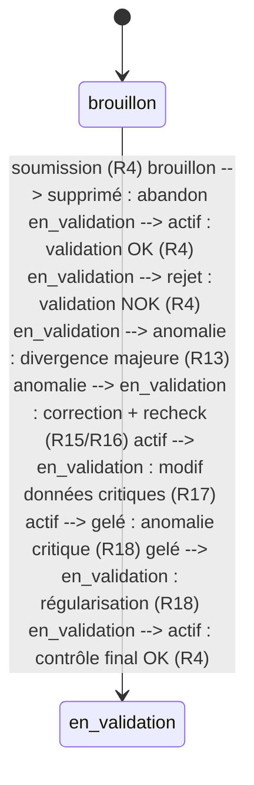

# Référentiel Captive — Cinématique (métier) 

## Sommaire (global)
- [Sommaire (global)](#sommaire-global)
- [Objectif](#objectif)
- [Mécanique générale du site (macro‑vue)](#mecanique-generale-du-site-macrovue)
- [Capital & stress — méthodes (mode d’emploi)](#capital-stress-methodes-mode-demploi)
- [Programmes d’assurance — cinématique (9 blocs)](#programmes-dassurance-cinematique-9-blocs)
- [Programmes d’assurance — rôle dans le site](#programmes-dassurance-role-dans-le-site)
- [Schéma technique — de la création captive aux paramétrages](#schema-technique--de-la-creation-captive-aux-parametrages)
- [Les deux notions de « programme » (détail approfondi)](#les-deux-notions-de-programme-detail-approfondi)
- [Mode d’emploi (pas à pas)](#mode-demploi-pas-a-pas)
- [Accès](#acces)
- [Navigation par blocs](#navigation-par-blocs)
- [Logique d’affichage](#logique-daffichage)
- [Cinématique d’un bloc (standard CRUD)](#cinematique-dun-bloc-standard-crud)
- [Particularités](#particularites)
- [Cibles métier couvertes](#cibles-metier-couvertes)
- [Partenaires (personnes morales) — cadrage](#partenaires-personnes-morales-cadrage) 

## Objectif
Le module « Référentiel Captive » permet d’administrer les référentiels et règles d’éligibilité d’une captive (CRUD), avec une navigation par blocs indépendants. 

## Mécanique générale du site (macro‑vue)
Le site s’appuie sur un socle de référentiels. Le « Référentiel Captive » est la base structurante : il définit **les branches d’assurance de la captive** (Solvabilité II), leurs catégories et les règles de gouvernance associées. Les autres modules consomment ce socle pour fonctionner de manière cohérente. - **Référentiel Captive** : base des branches, catégories, règles d’éligibilité, paramètres de risque, réassurance/fronting, capital & stress, programmes et leurs liaisons.
- **Programmes / Sinistres / Reporting** : s’appuient sur ces référentiels pour produire une vue opérationnelle et des exports fiables.
- **Audit** : traçabilité des changements sur les référentiels et règles. 

## Capital & stress — méthodes (mode d’emploi)
- **STANDARD_FORMULA** : méthode standard Solvabilité II, avec un % de charge de capital et un scénario de stress optionnel.
- **INTERNAL_MODEL** : modèle interne de la captive ; même structure d’entrée mais gouvernance interne plus stricte.
- **SIMPLIFIED** : approche simplifiée avec un % de charge allégé. Champs clés : branche (obligatoire), méthode, charge %, scénario, période de validité (début/fin). En résumé : **les branches “vivent” dans le Référentiel Captive**. C’est là que l’on construit et gouverne la structure métier de la captive. 

## Programmes d’assurance — cinématique (9 blocs)
Bloc opérationnel structuré en sous‑menus, sur le même modèle que le Référentiel Captive. Blocs :
1. Programmes
2. Sous‑contrats / Tranches
3. Garanties
4. Franchises
5. Exclusions
6. Conditions particulières
7. Assureurs / Portage
8. Documents & pièces
9. Historique & validations Mode d’emploi (Documents & pièces) :
- Déposer un fichier via le champ **Fichier** (stockage sécurisé).
- Le nom du fichier est cliquable et ouvre un **aperçu intégré**.
- Pas de téléchargement direct. 

## Programmes d’assurance — rôle dans le site
Le module « Programmes d’assurance » est **opérationnel** : il sert à créer et suivre les programmes concrets (ligne de risque, statut, montants garantis, franchises, devise, période, description). Il s’appuie sur le Référentiel Captive pour rester cohérent (branches, règles, paramètres), alors que le référentiel reste **structurel**. 

## Schéma technique — de la création captive aux paramétrages
```mermaid
flowchart TD
  SA[Superadmin] --> C1[POST /api/superadmin/captives]
  C1 --> CAPT[(captives)]
  C1 -->|referential_seed=1| REF[Initialisation referentiel]
  REF --> CAT[(insurance_branch_category)]
  REF --> BR[(insurance_branch)]
  REF --> BCM[(insurance_branch_category_map)]
  REF --> IP[(insurance_program)]
  REF --> PBM[(program_branch_map)]
  REF --> POL[(captive_branch_policy)]
  REF --> RISK[(branch_risk_parameters)]
  REF --> REIN[(branch_reinsurance_rules)]
  REF --> CAP[(branch_capital_parameters)]
  REF --> VER[(branch_policy_version)]

  SA --> U1[POST/PATCH /api/superadmin/users]
  U1 --> UCM[(user_captive_memberships)]

  LOGIN[POST /api/auth/login] --> JWT[JWT avec cid = captive_id]
  JWT --> CREF[/api/captive/*]
  CREF --> CAT
  CREF --> BR
  CREF --> BCM
  CREF --> IP
  CREF --> PBM
  CREF --> POL
  CREF --> RISK
  CREF --> REIN
  CREF --> CAP
  CREF --> VER

  JWT --> PGM[/api/programmes]
  PGM --> P[(programmes)]
  P --> PL[(programme_layers)]
  P --> PC[(programme_coverages)]
  P --> PD[(programme_deductibles)]
  P --> PX[(programme_exclusions)]
  P --> PCO[(programme_conditions)]
  P --> PI[(programme_insurers)]
  P --> PCR[(programme_carriers)]
  P --> PDoc[(programme_documents)]
  P --> PV[(programme_versions)]

  P --> PP[(partner_programme)]
  P --> CT[(contracts)]
  P --> SIN[(sinistres)]
  SIN --> REG[(reglements)]
```

## Les deux notions de « programme » (détail approfondi)
Dans CAPTIVA, le mot « programme » recouvre deux objets différents qui n’ont pas le meme role.

### 1) `insurance_program` (referentiel captive)
- **Nature** : objet de structuration interne du référentiel captive.
- **Table** : `insurance_program`.
- **Portée** : strictement rattachée a une captive (`captive_id` obligatoire).
- **Finalité** : organiser le référentiel et relier un programme de référentiel a une ou plusieurs branches via `program_branch_map`.
- **Utilisation UI/API** : bloc `Programmes` de `/captive` et bloc `Programmes ↔ Branches` de `/captive`.
- **Routes** : `/api/captive/programs`, `/api/captive/program-branches`, et en superadmin `/api/superadmin/programs`.
- **Effet métier** : gouvernance et cohérence du socle (taxonomy, pilotage, paramétrage transverse).
- **Cycle de vie** : créé au seed de captive (optionnel), puis maintenu dans le référentiel.

### 2) `programmes` (programme d’assurance operationnel)
- **Nature** : objet opérationnel de souscription/gestion.
- **Table** : `programmes`.
- **Portée** : programme concret utilisé dans la chaine métier.
- **Finalité** : porter la fiche produit d’assurance et tous ses composants contractuels.
- **Utilisation UI/API** : module `/programmes` (Programmes, Tranches, Garanties, Franchises, Exclusions, Conditions, Fronting/Reassurance, Carriers, Documents, Versions).
- **Routes** : `/api/programmes` et tous les sous-endpoints `/api/programmes/*`.
- **Effet métier** : pivot de production pour:
  - `contracts` (contrat = partenaire + client + programme),
  - `sinistres` / `reglements`,
  - `partner_programme`,
  - reporting/export.
- **Cycle de vie** : création d’une fiche programme, enrichissement progressif des paramètres, puis exploitation via partenaires/contrats/sinistres.

### Pourquoi cette séparation est utile
- **Séparation structure vs execution** : le référentiel captive décrit le cadre; le module programmes exécute l’activité assurance réelle.
- **Gouvernance** : les équipes peuvent stabiliser le socle (branches, politiques, risque, capital) sans bloquer la vie des programmes opérationnels.
- **Traçabilité** : chaque couche a ses propres logs/audits et son propre rythme d’évolution.
- **Scalabilité métier** : on peut faire évoluer la taxonomie captive sans casser les objets opérationnels historiques.

### Comparatif synthétique
| Aspect | `insurance_program` | `programmes` |
|---|---|---|
| Domaine | Référentiel captive | Opération assurance |
| Table principale | `insurance_program` | `programmes` |
| Scope captive | Oui, natif (`captive_id`) | Oui fonctionnellement, pivot d’exploitation |
| Liaisons clés | `program_branch_map` | `programme_layers`, `programme_coverages`, `contracts`, `sinistres` |
| Ecran principal | `/captive?section=programs` | `/programmes?section=programmes` |
| Objectif | Structurer le cadre | Produire et gérer les contrats/sinistres |
| Consommateurs | Référentiel et gouvernance | Partenaires, contrats, sinistres, reporting |

### Trajet recommandé (end-to-end)
1. Créer la captive en superadmin.
2. Assigner les utilisateurs a la captive.
3. Construire le référentiel captive (catégories, branches, politiques, risque, réassurance, capital, versions).
4. Définir les `insurance_program` et leurs mappings aux branches.
5. Créer les `programmes` opérationnels.
6. Paramétrer couches, garanties, franchises, exclusions, conditions, assureurs, documents, versions.
7. Associer partenaires ↔ programmes, créer contrats, puis gérer sinistres/reglements.

### Point d’attention de l’implémentation actuelle
- Le code contient encore un risque de confusion entre les deux objets si la gouvernance n’est pas explicitée aux utilisateurs.
- Recommandation produit: renommer les libellés UI pour lever l’ambiguite:
  - `Programmes de referentiel` (pour `insurance_program` dans `/captive`),
  - `Programmes d’assurance operationnels` (pour `programmes` dans `/programmes`).

## Mode d’emploi (pas à pas)
1. **Catégories** : créer d’abord les catégories métier (secteurs / types d’activité).
2. **Branches** : créer les branches Solvabilité II (S2) de la captive.
3. **Branches ↔ Catégories** : relier les branches aux catégories (mapping N–N).
4. **Politiques d’éligibilité** : définir l’éligibilité par branche (autorisé / restrictions / validation).
5. **Paramètres de risque** : définir les limites, volatilité, capital par branche.
6. **Réassurance & fronting** : définir les règles de cession / rétention par branche.
7. **Programmes** : créer les programmes de la captive.
8. **Programmes ↔ Branches** : relier les programmes aux branches.
9. **Capital & stress** : paramétrer les charges de capital par branche.
10. **Versions de politique** : historiser les changements de politiques.
11. **Journal d’audit** : vérifier la traçabilité. 

## Accès
- Entrée principale : menu latéral « Référentiel Captive ».
- À l’entrée, le menu latéral est remplacé par un sous‑menu dédié au référentiel.
- Le sous‑menu propose une option « < Retour » pour revenir au menu principal. 

## Navigation par blocs
Chaque bloc est indépendant et affiché seul via le sous‑menu (un bloc = un écran). Ordre des blocs :
1. Catégories
2. Branches
3. Branches ↔ Catégories
4. Politiques d’éligibilité
5. Paramètres de risque
6. Réassurance & fronting
7. Programmes
8. Programmes ↔ Branches
9. Capital & stress
10. Versions de politique
11. Journal d’audit 

## Logique d’affichage
- Chaque clic dans le sous‑menu charge un bloc unique (pas de scroll sur tout le référentiel).
- Les blocs sont découplés pour permettre la gestion fine d’affichage par menu. 

## Cinématique d’un bloc (standard CRUD)
1. **En‑tête de bloc** : titre + description + actions (Export si disponible).
2. **Ajout** : formulaire repliable (bouton « Afficher l’ajout » / « Masquer l’ajout »).
3. **Recherche & pagination** : barre de recherche + taille de page (par défaut 10) + navigation.
4. **Filtres** : ligne compacte au‑dessus du tableau pour filtrer la liste.
5. **Tableau** : liste des éléments avec actions (éditer / supprimer). 

## Particularités
- Les colonnes d’identifiants (ID) sont masquées dans les tableaux pour la lisibilité.
- Le journal d’audit est réservé aux profils autorisés (admin). 

## Cibles métier couvertes
- Gouvernance des branches et de leurs catégories.
- Politique d’éligibilité (restrictions, fronting, réassurance, validation).
- Paramètres de risque et capital.
- Traçabilité via l’audit. 

## Partenaires (personnes morales) — cadrage 

### Sommaire (Partenaires)
- [Sommaire (Partenaires)](#sommaire-partenaires)
- [Synthèse (exécutif)](#synthese-executif)
- [Schema d'architecture d'ingestion](#schema-darchitecture-dingestion)
- [Cinématique "Partenaires" (listes & fiches)](#cinematique-partenaires-listes-fiches)
- [Liste partenaires — colonnes & KPI](#liste-partenaires-colonnes-kpi)
- [Modèle relationnel (haut niveau)](#modele-relationnel-haut-niveau)
- [Mini‑schéma ER (Mermaid)](#minischema-er-mermaid)
- [Index recommandés](#index-recommandes)
- [Règles applicatives (validation)](#regles-applicatives-validation)
- [Workflow de statuts (Mermaid)](#workflow-de-statuts-mermaid)
- [Mapping transitions → règles](#mapping-transitions-regles)
- [Mapping règles → modules impactés](#mapping-regles-modules-impactes)
- [Roadmap (MVP → V2 → V3)](#roadmap-mvp-v2-v3)
- [Critères d’acceptation par lot](#criteres-dacceptation-par-lot)
- [Fiche partenaire (bloc unique, sous‑menu interne)](#fiche-partenaire-bloc-unique-sousmenu-interne)
- [Périmètre & volumétrie](#perimetre-volumetrie)
- [Identifiants & pièces](#identifiants-pieces)
- [Données à récupérer](#donnees-a-recuperer)
- [Chaîne de récupération & qualité](#chaine-de-recuperation-qualite)
- [LCBFT (niveau 1)](#lcbft-niveau-1)
- [GED & stockage documentaire](#ged-stockage-documentaire)
- [Règles de filtres & KPIs](#regles-de-filtres-kpis) 

### Synthèse (exécutif)
- France en phase 1, architecture extensible UE (ES/IT/DE/LU/BE).
- 3 000 à 20 000 partenaires, principalement courtiers.
- Identifiant pivot SIREN, SIRET au besoin pour établissements.
- Données: légales, capital social, bénéficiaires effectifs, CA/résultat net.
- Pipeline automatisé (APIs + Kbis + OCR) avec alertes et validation manuelle en cas de doute.
- GED client: paramètres d’accès fournis par le client, journalisation des accès. 

### Schéma d’architecture d’ingestion
```
Sources - APIs nationales gratuites (France, puis UE) - Kbis PDF natifs - Kbis PDF images - GED client (pieces justificatives) | v
Collecte / Connecteurs - Connecteurs API pays (abstraction par pays) - Connecteur GED (config client) - Upload manuel Kbis | v
Traitements - Parsing PDF natif - OCR (PDF image) - Extraction entites (raison sociale, SIREN/SIRET, dirigeants, capital) | v
Normalisation & Qualite - Normalisation formats (adresse, dates, codes) - Deduplication (SIREN pivot) - Regles de coherence multi-sources | v
Enrichissement - Beneficiaires effectifs (LCBFT) - CA / resultat net | v
Workflow de validation - Automatisation par defaut - Alertes de doute -> verification manuelle - Journal d'audit des validations | v
Stockage & Exposition - Referentiel partenaires (master data) - Historisation des changements - GED: stockage documents + logs - APIs internes / exports
``` 

### Cinématique "Partenaires" (listes & fiches)
- **Entrée principale : Liste des partenaires** (courtiers), **25 par page**.
- **Filtres initiaux** : programmes d’activité, statut, zone, date de mise à jour.
- **Indicateur clé** : **clients par contrat** (un partenaire peut commercialiser plusieurs programmes).
- **Recherche rapide** : SIREN/SIRET, raison sociale.
- **Actions** : créer, importer, ouvrir fiche partenaire. 

### Liste partenaires — colonnes & KPI
- **Colonnes recommandées** : raison sociale, SIREN, statut, programme(s) d’activité (tag), nb programmes, **clients/contrats**, dernière mise à jour.
- **Tri par défaut** : dernière mise à jour (desc).
- **KPI** : - **Clients/contrats** = total des clients rattachés au partenaire sur l’ensemble des programmes commercialisés. - **Nb programmes** = nombre de programmes d’assurance actifs commercialisés par le partenaire. 

### Dictionnaire des champs (liste partenaires)
- **raison_sociale** : nom légal de l’entité.
- **siren** : identifiant légal de l’entreprise (9 chiffres).
- **statut** : statut partenaire (voir glossaire).
- **programme_activite** : tags d’activité (ex: assurance IARD, vie, santé).
- **nb_programmes** : nombre de programmes actifs commercialisés.
- **clients_contrats** : nombre de clients ayant au moins un contrat actif via ce partenaire.
- **date_maj** : date de dernière mise à jour des données partenaires. 

### Modèle relationnel (haut niveau)
- **Partenaire** (personne morale) ↔ **Programme d’assurance** : relation **N–N**.
- **Partenaire** ↔ **Client** : relation **N–N** via **Contrat**.
- **Contrat** relie **Client**, **Programme** et **Partenaire** (un même partenaire vend plusieurs programmes, un client peut avoir plusieurs contrats).
- **Correspondants** : 1 partenaire ↔ N correspondants **commerciaux** et **back‑office** (rôles distincts). 

### Mini‑schéma ER (Mermaid)
```mermaid
erDiagram PARTENAIRE ||--o{ partenaire_programme : commercialise PROGRAMME ||--o{ partenaire_programme : est_propose PARTENAIRE ||--o{ contrat : vend CLIENT ||--o{ contrat : souscrit PROGRAMME ||--o{ contrat : couvre PARTENAIRE ||--o{ affectation_correspondant : a CORRESPONDANT ||--o{ affectation_correspondant : est_affecte PARTENAIRE { uuid partenaire_id PK string siren UK string siret_siege string raison_sociale string statut string code_ape string adresse_siege date date_immatriculation date date_maj } PROGRAMME { uuid programme_id PK string nom string branche string statut } CLIENT { uuid client_id PK string nom string type // personne_morale | personne_physique } CONTRAT { uuid contrat_id PK uuid partenaire_id FK uuid programme_id FK uuid client_id FK string statut date date_debut date date_fin string devise } CORRESPONDANT { uuid correspondant_id PK string type // commercial | back_office string nom string email UK string telephone } AFFECTATION_CORRESPONDANT { uuid affectation_id PK uuid partenaire_id FK uuid correspondant_id FK string role // commercial | back_office date date_debut date date_fin string statut }
``` 

### Index recommandés
- **partenaire** : `siren` (unique), `statut`, `date_maj`, `code_ape`.
- **programme** : `statut`, `branche`.
- **client** : `type`.
- **contrat** : (`partenaire_id`, `statut`), (`programme_id`, `statut`), (`client_id`, `statut`), `date_debut`.
- **correspondant** : `email` (unique), `type`.
- **affectation_correspondant** : (`partenaire_id`, `role`), (`correspondant_id`, `role`), `date_debut`. 

### Règles applicatives (validation)
- R1 - **Création partenaire** : SIREN obligatoire, unique, format contrôlé ; si SIREN déjà présent → blocage.
- R2 - **SIRET siège** : obligatoire si adresse siège renseignée ; doit partager le même SIREN.
- R3 - **Données minimales** : raison sociale, statut, adresse siège, code APE/NAF requis pour passage en actif.
- R4 - **Statuts partenaires** : brouillon → en_validation → actif ; anomalie conformité bloque le passage à actif.
- R5 - **Contrat actif** : `date_debut` <= aujourd’hui ET (`date_fin` vide OU `date_fin` > aujourd’hui).
- R6 - **Doublon contrat** : interdiction de 2 contrats actifs pour le même triplet (partenaire, programme, client).
- R7 - **Programmes** : un programme inactif ne peut pas être associé à un nouveau contrat.
- R8 - **Clients** : un client sans contrat actif ne compte pas dans l’indicateur “clients/contrats”.
- R9 - **Affectations correspondants** : une affectation active par rôle et partenaire ; chevauchement de périodes interdit.
- R10 - **Correspondants** : email obligatoire, format contrôlé ; type ∈ {commercial, back_office}.
- R11 - **Conformité** : pièce expirée ou manquante → statut conformité = anomalie (alerte bloquante).
- R12 - **LCBFT** : bénéficiaires effectifs requis avant activation si seuils applicables.
- R13 - **Workflow d’alerte** : toute divergence inter‑source majeure impose validation manuelle.
- R14 - **Historisation** : tout changement sur identité légale, statut, dirigeants, capital ou pièces crée une trace d’audit.
- R15 - **Re‑vérification périodique** : contrôle automatique trimestriel des pièces et données sensibles.
- R16 - **Rollback validation** : une validation peut être annulée si une pièce devient expirée ou si une divergence majeure est détectée.
- R17 - **Re‑validation** : toute mise à jour de données critiques (SIREN, dirigeants, capital, bénéficiaires) repasse en en_validation.
- R18 - **Gel opérationnel** : en cas d’anomalie critique (fraude suspectée, pièce invalide), blocage des nouveaux contrats jusqu’à régularisation. 

### Workflow de statuts (Mermaid)


### Mapping transitions → règles
| Transition | Règle |
|---|---|
| brouillon → en_validation (soumission) | R4 |
| en_validation → actif (validation OK) | R4 |
| en_validation → rejet (validation NOK) | R4 |
| en_validation → anomalie (divergence majeure) | R13 |
| anomalie → en_validation (correction + recheck) | R15 / R16 |
| actif → en_validation (modif données critiques) | R17 |
| actif → gelé (anomalie critique) | R18 |
| gelé → en_validation (régularisation) | R18 |
| en_validation → actif (contrôle final OK) | R4 | 

### Mapping règles → modules impactés
| Règle | Modules | Effets principaux |
|---|---|---|
| R1–R3 | Référentiel partenaires | Validation création / activation partenaire |
| R4 | Workflow partenaires | Transitions de statut |
| R5–R8 | Contrats / Programmes / Reporting | Calcul “clients/contrats”, éligibilité |
| R9–R10 | Correspondants | Affectations, contrôles de cohérence |
| R11–R13 | Conformité / LCBFT | Blocages, alertes, validations manuelles |
| R14 | Audit | Historisation et traçabilité |
| R15–R18 | Contrôles périodiques / Workflow | Recheck, rollback, gel | 

### Roadmap (MVP → V2 → V3)
- **MVP** : liste partenaires + fiche, SIREN/SIRET, programmes liés, correspondants, workflow de statut, Kbis/LCBFT niveau 1, GED client, audit.
- **V2** : enrichissement données financières, alertes multi‑sources, re‑vérifications automatiques, indicateurs avancés.
- **V3** : extension UE (ES/IT/DE/LU/BE), connecteurs pays, normalisation multi‑juridiction. 

### Critères d’acceptation par lot
- **MVP** : - Liste partenaires paginée (25), recherche + filtres (programme, statut, zone, commercial, back‑office). - Fiche partenaire complète (identité, programmes, clients/contrats, correspondants, conformité, audit). - Workflow de statuts opérationnel avec alertes et validation manuelle. - GED client intégrée (stockage Kbis + pièces LCBFT).
- **V2** : - Enrichissement financier (CA, résultat net) + sources multiples. - Alertes de divergences inter‑sources + re‑vérification automatique. - KPI avancés (taux de conformité, churn contrats, etc.).
- **V3** : - Connecteurs pays (ES/IT/DE/LU/BE) + normalisation multi‑juridiction. - Gestion des pièces légales selon pays + mapping des identifiants. 

## Guide d’utilisation — Module Partenaires

### Accès
- Menu principal → **Partenaires**.
- Sous‑menu : **Liste partenaires**, **Correspondants**, **Clients**, **Contrats**, **Documents**.

### Liste partenaires
- **Filtres** : statut, programme, commercial, back‑office, conformité, pays/région, recherche (SIREN / raison sociale).
- **KPI** : total, actifs, anomalies + taux d’anomalies.
- **Actions** : sélectionner une ligne pour afficher la fiche partenaire.
- **Export** : bouton **Exporter CSV** (inclut correspondants et programmes liés).

### Fiche partenaire
- **Edition rapide** : statut + conformité (avec notes si anomalie).
- **Programmes** : associer/retirer un programme.
- **Correspondants** : affecter/retirer un commercial ou back‑office.
- **Contrats** : création rapide + liste des contrats liés.
- **Documents** : aperçu du statut et liste synthétique.
- **Export JSON** : bouton **Exporter JSON** (fiche complète).

### Correspondants
- Création d’un **correspondant** (commercial/back‑office).
- Liste consultable et réutilisable pour les affectations.

### Clients
- Création de clients (personne morale / physique).
- Liste consultable pour rattacher un contrat.

### Contrats
- Création rapide d’un contrat (partenaire, programme, client, dates, statut).
- Liste consultable + suppression.

### Documents
- Sélection d’un partenaire.
- Ajout d’un document (KBIS / ID / LCBFT / OTHER).
- Lien **voir** pour ouvrir le document stocké.

### Règles clés (rappel)
- **SIREN unique** par partenaire.
- **SIRET siège** doit correspondre au SIREN.
- **Contrat actif** unique par (partenaire, programme, client).
- **Programme inactif** non associable à un nouveau contrat.
- **Conformité en anomalie** → blocage des validations.


### Fiche partenaire (bloc unique, sous‑menu interne)
- **Identité légale** (SIREN/SIRET, statut, adresse, APE/NAF).
- **Programmes commercialisés** (N–N avec programmes d’assurance).
- **Clients liés / contrats** (compteurs + accès direct).
- **Correspondants** : **commerciaux** et **back‑office** attitrés.
- **Conformité & pièces** : Kbis, LCBFT, bénéficiaires effectifs, alertes.
- **Financier** : CA, résultat net.
- **Historique & audit**. 

### Dictionnaire des champs (fiche partenaire)
- **identite_legale** : raison sociale, SIREN/SIRET, statut, APE/NAF, adresse siège.
- **programmes_commercialises** : liste des programmes actifs liés au partenaire.
- **clients_contrats** : compteur des clients et accès aux contrats associés.
- **correspondants** : commerciaux et back‑office rattachés (rôle, dates, coordonnées).
- **conformite** : statut conformité, pièces Kbis/LCBFT, alertes.
- **beneficiaires_effectifs** : liste des BE, statut de complétude.
- **financier** : CA, résultat net, date de référence.
- **historique_audit** : journal des modifications et validations. 

### Dictionnaire des champs (contrat)
- **contrat_id** : identifiant unique du contrat.
- **partenaire_id** : référence du partenaire vendeur.
- **programme_id** : référence du programme associé.
- **client_id** : référence du client.
- **statut** : brouillon / actif / suspendu / résilié.
- **date_debut / date_fin** : période de validité.
- **devise** : devise du contrat. 

### Dictionnaire des champs (programme)
- **programme_id** : identifiant unique du programme.
- **nom** : nom commercial.
- **branche** : branche d’assurance (S2).
- **statut** : actif / inactif. 

### Périmètre & volumétrie
- **France uniquement (phase 1)**, avec une architecture pensée pour intégrer ensuite **Espagne, Italie, Allemagne, Luxembourg, Belgique**.
- **Volumétrie estimée** : 3 000 à 20 000 partenaires.
- **Typologie** : personnes morales, principalement **courtiers**. 

### Identifiants & pièces
- **Identifiant principal** : **SIREN** (entité légale).
- **SIRET** utilisé pour les établissements quand nécessaire (agences, points de vente).
- **Justificatifs** : **Kbis natifs** + **Kbis images** (OCR si besoin), avec traçabilité des sources et dates. 

### Données à récupérer
- **Données légales** : raison sociale, siège, statut, dirigeants, activité (APE/NAF).
- **Capital social**.
- **Bénéficiaires effectifs** (LCBFT/TRACFIN).
- **Chiffre d’affaires** et **résultat net**. 

### Chaîne de récupération & qualité
- **APIs nationales gratuites** à déterminer (France d’abord), via une couche d’abstraction pour l’extension UE.
- **Extraction PDF** : parsing natif + OCR si document image.
- **Normalisation** : formats uniques (adresse, raison sociale, codes, dates).
- **Historisation** : conserver l’évolution (dirigeants, capital, statut, adresse).
- **Contrôle de cohérence** : signaler les divergences entre sources. 

### LCBFT (niveau 1)
- **Détail niveau 1** avec alertes de doute.
- **Pièces justificatives** : passeport ou carte nationale d’identité.
- **Workflow** : automatisation complète, avec **mise en garde** si doute et **validation manuelle** avant publication. 

### GED & stockage documentaire
- **GED fournie par le client**.
- À recueillir : **localisation**, **modalité d’accès**, **identifiant** et **mot de passe**.
- Conservation des documents avec **journalisation** des accès et des modifications. 

### Règles de filtres & KPIs
- **Filtres initiaux** : programme d’activité, statut, **zone géographique (pays/région)**, date mise à jour, présence d’alertes conformité, **commercial** assigné, **correspondant back‑office**.
- **Recherche rapide** : SIREN/SIRET, raison sociale (tolérance aux variantes).
- **Définition “clients/contrats”** : total des clients ayant au moins un contrat actif via ce partenaire.
- **Alertes** : statut conformité en anomalie, pièces expirées, divergence sources. 

### Glossaire & valeurs autorisées
- **Statut partenaire** : `brouillon`, `en_validation`, `actif`, `anomalie`, `gelé`, `supprimé`.
- **Statut contrat** : `brouillon`, `actif`, `suspendu`, `résilié`.
- **Type correspondant** : `commercial`, `back_office`.
- **Type client** : `personne_morale`, `personne_physique`.
- **Programme** : `actif`, `inactif`.
- **Anomalie critique** : fraude suspectée, pièce invalide, incohérence majeure inter‑source.


### FAQ opérationnelle (Partenaires)
- **Je ne vois pas un partenaire** : vérifier les filtres actifs et l’orthographe du SIREN.
- **Impossible d’activer un partenaire** : vérifier conformité (statut anomalie) et pièces obligatoires.
- **Contrat refusé** : programme inactif ou doublon de contrat actif.
- **Document non visible** : vérifier la référence GED ou l’upload (lien “voir”).
- **Correspondant non assignable** : un correspondant actif par rôle et partenaire (pas de doublon).

### Placeholders captures d’écran
- [ ] Liste partenaires (filtres + KPI + table)
- [ ] Fiche partenaire (statut, conformité, programmes, correspondants, contrats)
- [ ] Documents (ajout + liste)
